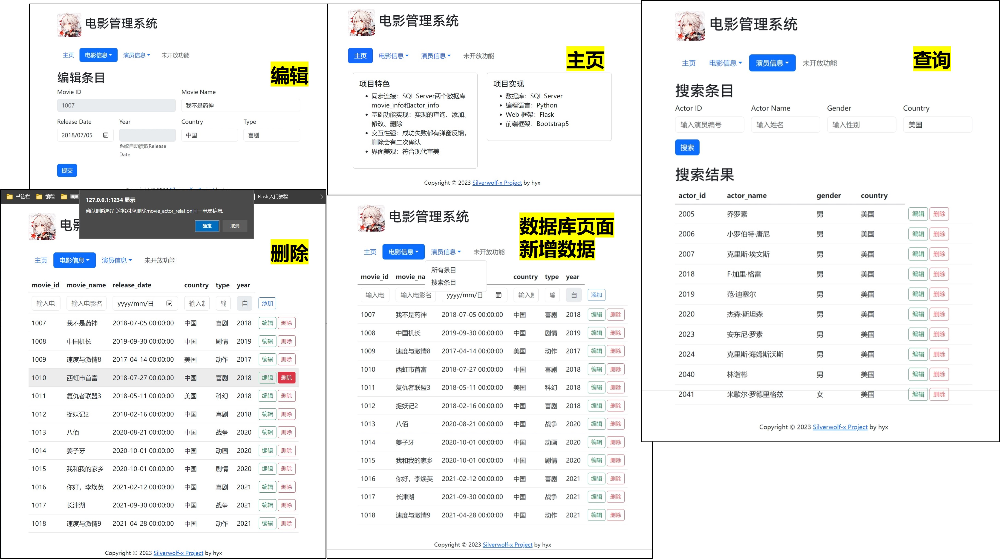

# 电影管理系统movie management system



hyx

数据库系统概论大作业

20231106

## 使用
- 安装所需python包，推荐3.10
    ```{python}
    pip install -r requirements.txt
    ```
    
- 运行`run.py`

## (可选) SQL server 配置
    
1. 下载安装SQL Server Management Studio

2. 在`SQL server配置管理器`中，打开`SQL server服务`；并在`SQL server网络配置`中，打开`TCP/IP配置`
> 否则会报错提示`DB-Lib error message 20009, severity 9`

3. SQL Server Management Studio运行`movie_init.sql`，存储movieDBtest数据库

4. 数据库配置：在`config.ini`中，修改`server`为本地服务器名称

> 一般而言，本地服务器自带有管理员账号sa，密码默认为123456


## 特色

- 同步连接：SQL server两个数据库movie_info和actor_info
- 基础功能实现：实现的查询、添加、修改、删除
- 交互性强：成功失败都有弹窗反馈，删除会有二次确认
- 界面美观：符合现代审美

## 实现

- 数据库：SQL server / sqlite3
- 编程语言：Python
- Web 框架：Flask
- 前端框架：Bootstrap5

## 参考

[RUCstore](https://git.ruc.edu.cn/gengdy/rustore)

[Flask 入门教程 3.0](https://helloflask.com/book/3/)

[Bootstrap5 中文手册](https://www.bootstrap.cn/doc/book/2.html)

## Flask学习过程

https://github.com/Silverwolf-x/study-flask.git

## 构建历史

20231124
重构项目文件夹结构，编辑初始化数据库相关内容；暂定实现的内容

20231202
基于flask-Bootstrap5完全重写前端，重写后端框架。现已做到查询、新建、删除功能

20231203

- 正式发布version-alpha

实现movie_info和actor_info两个表分别的查询、编辑、新建、删除

记得使用utf8编码的sql初始化数据

20131216
- 编辑主页，修改框架，正式发布version 1.0
- 分离search,edit,add的form，完备验证模块，发布version 1.1
- 修复movie无法添加信息，发布version 1.2

20231222
- 完善使用信息

20240222
- 增加sqlite数据库，方便随时运行该程序